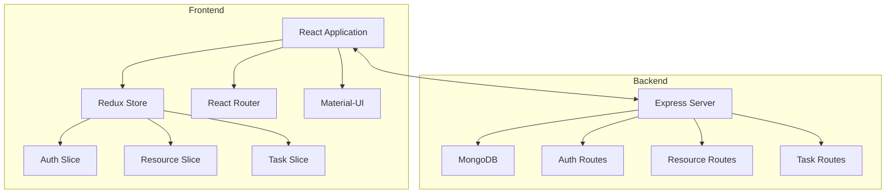
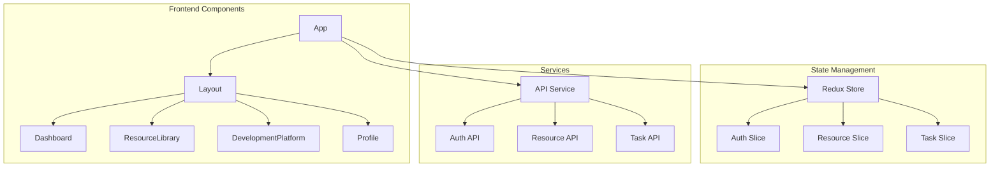
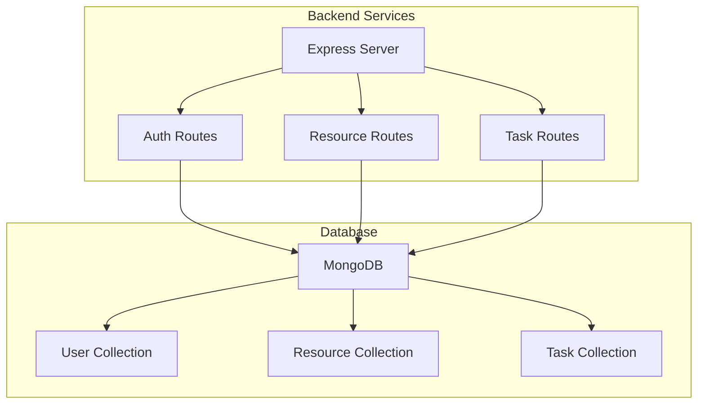
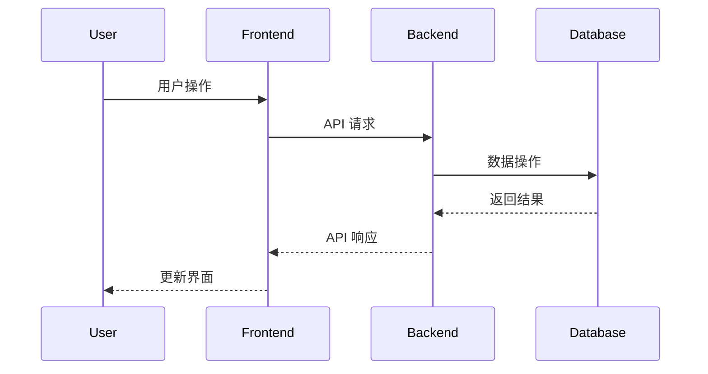
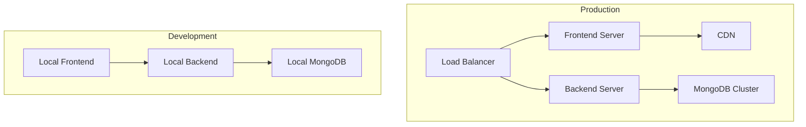

# Department Platform 项目架构文档

## 系统架构概览

## 前端架构

## 后端架构

## 技术栈

### 前端
- React 19.1.0
- TypeScript 4.9.5
- Redux Toolkit
- Material-UI 7.1.0
- React Router 7.6.0
- Axios

### 后端
- Node.js
- Express
- MongoDB
- Mongoose
- TypeScript

## 主要功能模块

1. 认证系统
   - 用户登录
   - 用户注册
   - 会话管理

2. 资源库
   - 资源管理
   - 资源分类
   - 资源搜索

3. 开发平台
   - 任务管理
   - 开发工具集成
   - 协作功能

4. 用户档案
   - 个人信息管理
   - 权限控制
   - 设置管理

## 数据流

## 部署架构

