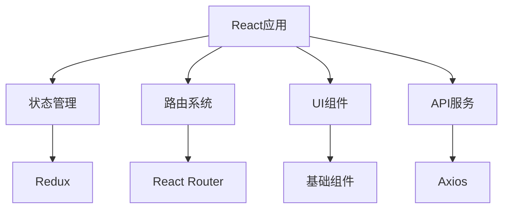
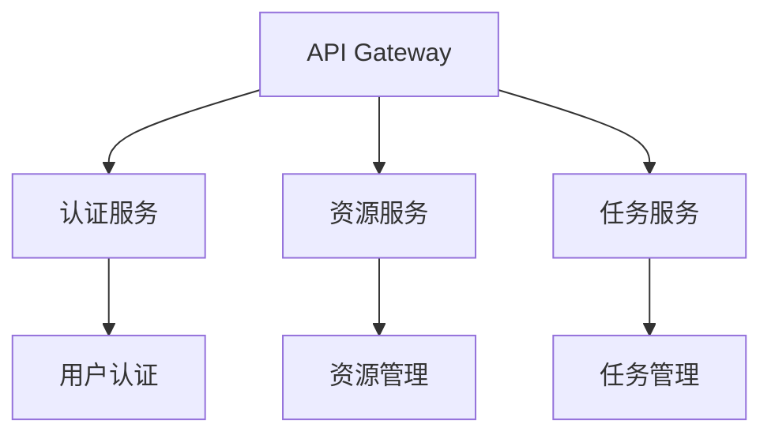
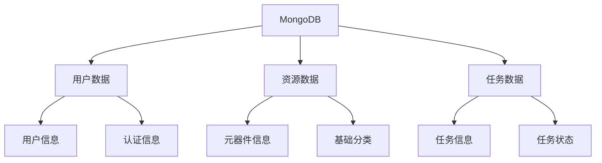
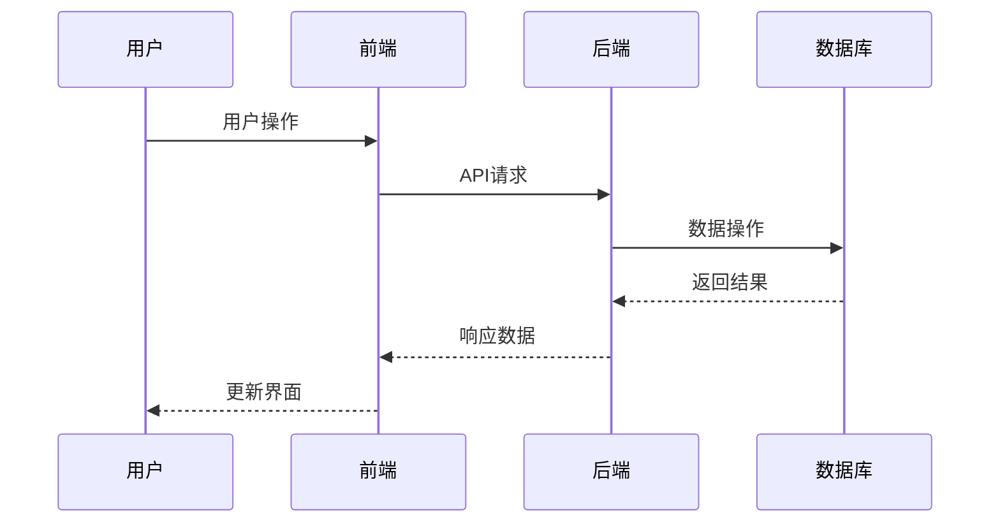
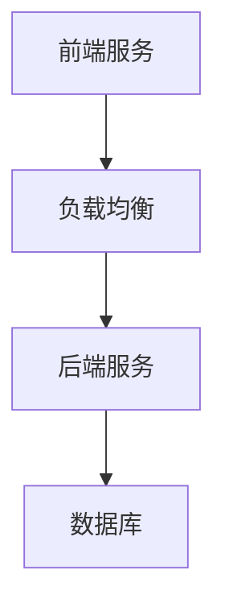

# 系统架构设计

## 一、系统概述

本系统采用前后端分离的微服务架构，基于React和Node.js技术栈，旨在构建一个最小可用系统，后续逐步扩展功能。

## 二、技术架构

### 2.1 前端架构



#### 2.1.1 技术选型
- 框架：React 18
- 语言：TypeScript
- 状态管理：Redux
- 路由：React Router
- UI组件：Ant Design
- 请求库：Axios

#### 2.1.2 目录结构
```
frontend/
├── src/
│   ├── components/     # 基础组件
│   ├── pages/         # 页面组件
│   ├── store/         # 状态管理
│   ├── services/      # API服务
│   ├── utils/         # 工具函数
│   └── App.tsx        # 应用入口
```

### 2.2 后端架构



#### 2.2.1 技术选型
- 框架：Express
- 语言：TypeScript
- 数据库：MongoDB
- 认证：JWT
- 中间件：CORS, Body-parser

#### 2.2.2 目录结构
```
backend/
├── src/
│   ├── routes/        # 路由定义
│   ├── controllers/   # 控制器
│   ├── models/        # 数据模型
│   ├── middleware/    # 中间件
│   ├── utils/         # 工具函数
│   └── app.ts         # 应用入口
```

### 2.3 数据库架构



#### 2.3.1 数据模型
- 用户模型：基础用户信息、认证信息
- 资源模型：元器件基本信息、基础分类
- 任务模型：任务基本信息、任务状态

## 三、系统模块

### 3.1 用户模块
- 基础认证
- 会话管理
- 基础权限

### 3.2 资源模块
- 元器件管理
- 基础分类
- 基础搜索

### 3.3 任务模块
- 任务管理
- 状态更新
- 基础关联

## 四、数据流



## 五、部署架构



## 六、安全架构

### 6.1 认证安全
- JWT认证
- 会话管理
- 密码加密

### 6.2 数据安全
- 数据验证
- 错误处理
- 日志记录

## 七、监控运维

### 7.1 系统监控
- 性能监控
- 错误监控
- 日志监控

### 7.2 运维支持
- 部署脚本
- 备份策略
- 恢复方案

## 更新记录

### 2025-05-20
- 创建架构文档
- 设计最小系统架构
- 设置基础技术栈 